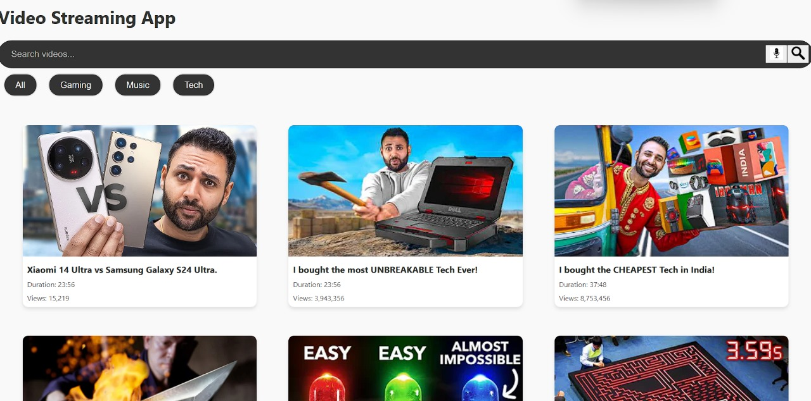
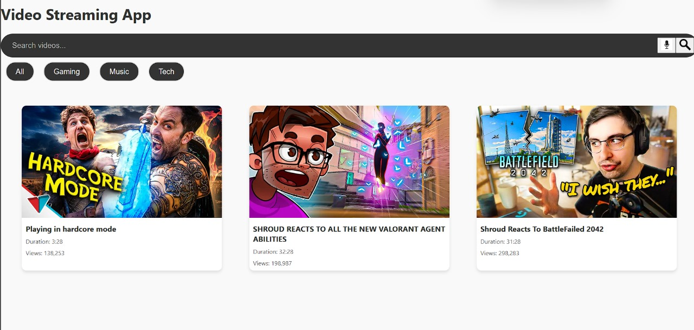
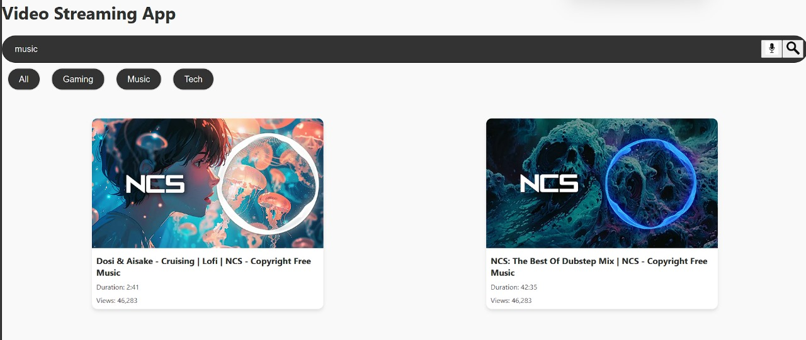

# Video Streaming Application
Welcome to the Video Streaming Application - a responsive, single-page application (SPA) designed to fetch and display video recommendations from a variety of categories including Gaming, Music, Tech, and more. Built with React, this application showcases dynamic data fetching, seamless category filtering, and a responsive design for an optimal user experience across all devices.

 

## Features
Dynamic Video Recommendations: Fetches videos from a public API to recommend the latest in Gaming, Music, Tech, and more.
Responsive Design: Crafted to provide an optimal viewing experience across a wide range of devices from desktop computers to mobile phones.
Interactive UI: Includes a search functionality that allows users to filter videos based on titles.
Category Filtering: Users can select different categories to browse videos of their interest.
Loading State: Displays a loader animation while fetching data to improve user experience.
Getting Started
These instructions will get you a copy of the project up and running on your local machine for development and testing purposes.

## Prerequisites
Node.js
npm
## Installation
Clone the repository

git clone https://github.com/ABISHEKBALANCE/Web-streaming-app.git

Navigate to the project directory

cd video-streaming-app
Install necessary packages

npm install
Run the application

npm start
The application will start running on http://localhost:3000.

Built With
React - The web framework used
React Transition Group - For animations
CSS - For styling

## Contributing
We welcome contributions to make this project even better. There are several ways you can contribute:

Reporting issues
Submitting fixes
Proposing new features
Please see CONTRIBUTING.md for details.

## License
This project is licensed under the MIT License - see the LICENSE.md file for details.

## Acknowledgments
Create React App for the initial setup.
The awesome public API we used for fetching video data.
